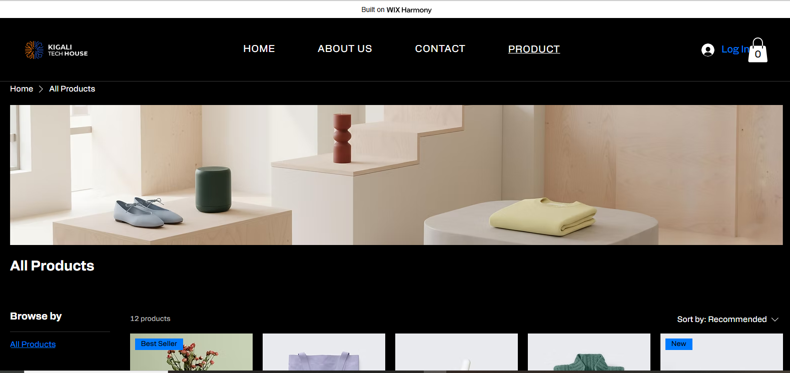

# 🏪 Kigali Tech House

### Electronic Devices & Home Technology Store

**Developed By:** IRADUKUNDA DERICK  
**Registration Number:** 23818/2024  
**University:** University of Lay Adventists of Kigali (UNILAK)  
**Course:** E-Commerce And Web Application (EWA408510)  
**Lecturer:** Eric Maniraguha  
**Academic Year:** 2025-2026  
**Semester:** II  

🌐 **Live Website:** https://michaelderick602.wixsite.com/kigali-tech-house

💻 **GitHub Repository:** https://github.com/lyon45/kigali-tech-house

---

# Student Information

| Item | Details |
|--------|--------|
| Student Name | IRADUKUNDA DERICK 
| Registration Number | 23818/2024 |
| University | University of Lay Adventists of Kigali (UNILAK) |
| Course | E-Commerce And Web Application (EWA408510) |
| Lecturer | Eric Maniraguha |
| Academic Year | 2025-2026 |
| Semester | II |
| Project Type | No-Code E-Commerce Website |
| Platform Used | Wix.com |

---

# Project Title

## Kigali Tech House – Electronic Devices & Home Technology Store

Kigali Tech House is an online e-commerce website developed using Wix.com. The website specializes in selling electronic devices, home technology products, and selected metal accessories. The platform provides customers with an easy and user-friendly shopping experience where they can browse products, learn about the company, contact the business, and interact with a shopping cart system.

---

# Project Objective

The objective of this project was to design and develop a functional e-commerce website using a No-Code platform while applying modern User Interface (UI) and User Experience (UX) principles. The project also demonstrates the use of GitHub Markdown documentation for professional project reporting.

---

# Platform Used

## Wix.com

The website was developed using Wix.com because it offers:

- Drag-and-drop website builder
- Professional e-commerce tools
- Product management system
- Responsive design
- Secure hosting
- Shopping cart functionality
- Easy customization
- No-code development environment

---

# Features Implemented

## Homepage

The homepage includes:

- Kigali Tech House logo
- Navigation menu
- Welcome message
- Company branding
- Professional dark-themed design
- Responsive layout

## Product Page

The product page includes:

- Product catalog
- Product images
- Product descriptions
- Product browsing functionality
- Shopping cart interaction
- Product categories

## About Us Page

The About Us page includes:

- Company background
- Mission statement
- Vision statement
- Leadership information
- Business profile

## Contact Page

The Contact page includes:

- Contact information
- Email communication
- Contact form
- Customer support section

## Cart Functionality

The website provides:

- Add-to-cart functionality
- Product selection
- Cart interaction
- Shopping experience simulation

---

# Website Pages

The website contains the following pages:

1. Home Page
2. Product Page
3. About Us Page
4. Contact Page
5. Shopping Cart Section

---

# Screenshots

## Homepage

.png)

### Description

The homepage welcomes visitors to Kigali Tech House and introduces the brand with a modern and professional design.

---

## Product Page



### Description

The product page displays available electronic products and accessories with images and shopping functionality.

---

## About Us Page

.png)

### Description

The About Us page presents information about Kigali Tech House, its mission, and leadership.

---

# User Interface and Navigation

The website was designed with the following principles:

- Easy navigation
- Professional appearance
- Responsive design
- Dark-themed interface
- Consistent branding
- User-friendly shopping experience

The navigation menu allows users to easily move between:

- Home
- Product
- About Us
- Contact

---

# Challenges Faced

During the development process, several challenges were encountered:

1. Selecting a suitable e-commerce template.
2. Organizing product categories effectively.
3. Customizing the Wix template to match the Kigali Tech House brand.
4. Managing website navigation.
5. Configuring cart interaction features.
6. Designing a professional user interface.

---

# Solutions Applied

The following solutions were implemented:

- Customized the selected Wix template.
- Organized products into a clear structure.
- Improved website navigation.
- Used Wix Store functionality for cart interaction.
- Applied consistent branding throughout the website.
- Optimized the design for better user experience.

---

# Lessons Learned

This project helped me learn:

- No-Code website development using Wix.
- E-commerce website design principles.
- Product management techniques.
- User Interface (UI) design.
- User Experience (UX) concepts.
- GitHub repository management.
- Markdown documentation.
- Professional portfolio development.

---

# Live Website Link

### Kigali Tech House Website

https://michaelderick602.wixsite.com/kigali-tech-house

---

# GitHub Repository Link

### GitHub Repository

https://github.com/lyon45/kigali-tech-house

---

# Repository Structure

```text
kigali-tech-house/
│
├── README.md
│
└── images/
    ├── HOME SCREEN(1).png
    ├── PRODUCT-SCREEN.png
    └── AABOUT US(1).png
```

---

# Evaluation Requirements Covered

| Requirement | Status |

| Homepage | ✅ Completed |
| Product Page | ✅ Completed |
| About Page | ✅ Completed |
| Contact Page | ✅ Completed |
| Cart Interaction | ✅ Completed |
| GitHub Repository | ✅ Completed |
| README Documentation | ✅ Completed |
| Screenshots Included | ✅ Completed |
| Live Website Link | ✅ Completed |

---

# Conclusion

Kigali Tech House successfully demonstrates the use of a No-Code platform to create a professional e-commerce website. The website provides product browsing, company information, customer communication, and shopping cart functionality while maintaining a modern and user-friendly interface. This project has strengthened my understanding of e-commerce development, website design, GitHub documentation, and digital business solutions.

---

# Author

**IRADUKUNDA DERICK**

**Registration Number:** 23818/2024

University of Lay Adventists of Kigali (UNILAK)

Course: E-Commerce And Web Application (EWA408510)

Academic Year: 2025-2026

Semester II

---

> "Your project is not just an assignment — it is part of your professional portfolio."
